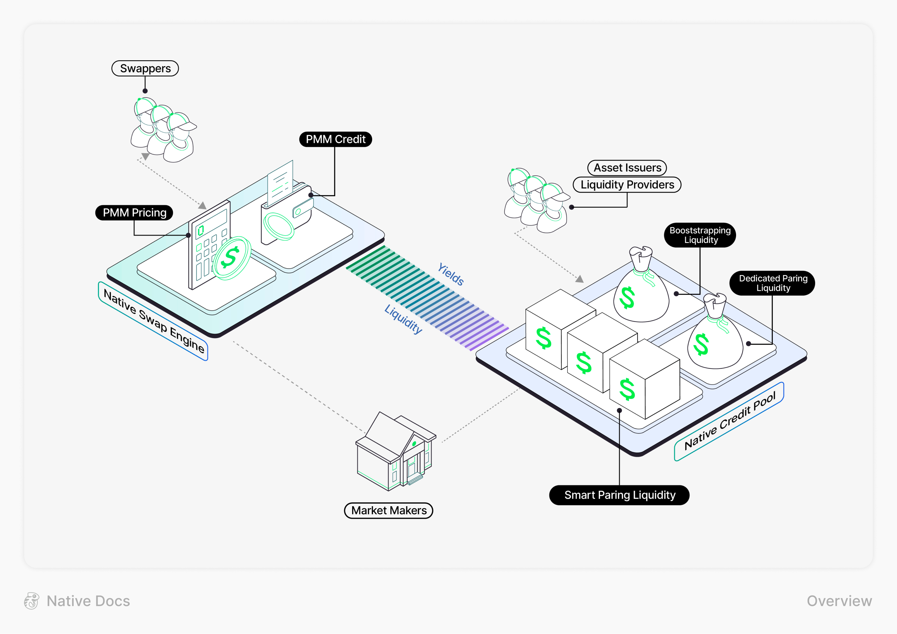

# What is Native

**Native** is an on-chain platform to build token liquidity that is openly accessible and cost effective. It serves as an alternative to traditional **AMMs** through integration of two innovative designs: the [**Native Swap Engine**](modules/native-swap-engine.md) and [**Native Credit Pool**](modules/native-credit-pool.md)**.**

The vision of Native is to transform on-chain liquidity from inventory-based to credit-based. Native is designed to address the limitations of current onchain marketplaces, including liquidity fragmentation and capital inefficiency, by decoupling the pricing capability and inventory provision, paving the way for a new era in decentralized finance.

<figure><figcaption></figcaption></figure>
