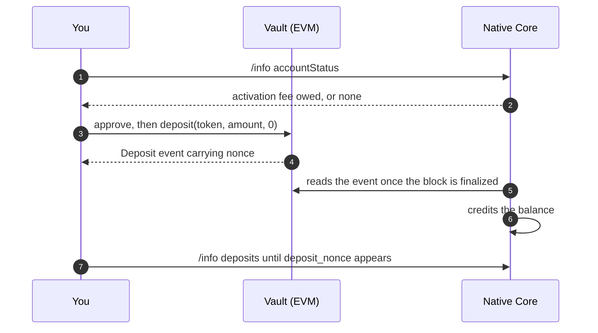

# Deposit

Five steps: check whether the account exists, size the activation fee it may owe, approve and deposit, read the nonce off the receipt, then wait for the credit on Native Core.

You initiate the EVM transaction. Native's settlement pipeline observes it and credits the balance — there is nothing to submit to Native, and closing your process after the transaction lands does not affect the credit.



Read [Deposit & Withdraw](README.md) first for the shared endpoints, discovery queries, and rate limits.

## 1. Check whether the account exists

An address that has never held a Native Core balance has no account yet, and its first deposit must pay a one-time activation fee. [`accountStatus`](../native-core/post-info.md#accountstatus) is the authoritative signal.

```bash
curl -sS -X POST "$API_URL/info" \
  -H 'content-type: application/json' \
  -d '{"type":"accountStatus","user":"0xbf381e1cbfdb0d02f3800010e490130d3dc73118"}'
```

```json
{ "found": true, "account_index": 6, "status": "active", "query_height": 126781073, "app_hash": "0x…" }
```

`found: true` means the account exists and the deposit carries no fee. `found: false` means this deposit will create it, and must carry the fee described next.

Treat an unreadable `accountStatus` as blocking. The vault does not enforce the fee, so a deposit sent while the answer is unknown can land on-chain and then fail validation.

## 2. Size the activation fee

The fee rides the deposit transaction as `msg.value`, in the source chain's gas token. No token allowance or second transaction is involved.

* The fee is worth **1 USD** in the chain's gas token, priced at the time the deposit is validated.
* Validation accepts a shortfall of up to **30%**, which absorbs the price movement between your quote and settlement.
* Overpayment is accepted and never refunded. Quote at your own spot price with a small buffer.
* Send `msg.value: 0` for every deposit into an account that already exists.


A first deposit that underpays past the tolerance is a **permanent** validation failure. The tokens sit in the vault, the balance is never credited, and the order is not retried — recovering it takes manual intervention from Native. Read `accountStatus` immediately before you build the transaction, and never guess the fee to zero.


## 3. Approve and deposit

`deposit()` pulls the ERC20 from the caller, so it needs an allowance first. Amounts are in the token's own decimals.

```solidity
function deposit(address token, uint256 amount, uint256 actionFlag)
    external payable returns (uint256 wNLPAmount);
```

Pass `actionFlag: 0` — the standard deposit path.

```ts
import { createPublicClient, createWalletClient, http, erc20Abi, parseUnits } from 'viem'
import { bsc } from 'viem/chains'
import { vaultAbi } from './vaultAbi'

const publicClient = createPublicClient({ chain: bsc, transport: http(RPC_URL) })
const wallet = createWalletClient({ chain: bsc, transport: http(RPC_URL), account })

const amount = parseUnits('100', 18)          // BSC USDT is 18-decimal
const feeWei = accountExists ? 0n : activationFeeWei

const [vaultPaused, tokenPaused] = await Promise.all([
  publicClient.readContract({ address: vault, abi: vaultAbi, functionName: 'emergencyPaused' }),
  publicClient.readContract({ address: vault, abi: vaultAbi, functionName: 'isDepositPaused', args: [token] }),
])
if (vaultPaused || tokenPaused) throw new Error('deposits are paused')

const approveHash = await wallet.writeContract({
  address: token, abi: erc20Abi, functionName: 'approve', args: [vault, amount],
})
await publicClient.waitForTransactionReceipt({ hash: approveHash })

const depositHash = await wallet.writeContract({
  address: vault, abi: vaultAbi, functionName: 'deposit',
  args: [token, amount, 0n], value: feeWei,
})
const receipt = await publicClient.waitForTransactionReceipt({ hash: depositHash })
```

Two on-chain rules reject a deposit before it reaches Native:

* **Precision.** `minDepositDecimalByUnderlying(token)` returns `8` for every listed token, matching Native's `balance_decimals`. An amount carrying more than 8 decimal places reverts `InvalidAmount` — for an 18-decimal token, `amount` must be a multiple of `10^10`.
* **Pause.** `isDepositPaused(token)` gates a single token; `emergencyPaused()` gates the whole vault. Read both before you build the transaction so the user sees a reason instead of a revert.

To fund an address other than the caller — a wallet or aggregator depositing on a user's behalf — use `depositFor`, which credits `user` instead of `msg.sender`:

```solidity
function depositFor(address token, uint256 amount, address user, uint256 actionFlag)
    external payable returns (uint256 wNLPAmount);
```

The activation fee follows the credited address, not the caller: read `accountStatus` for `user`.

## 4. Read the deposit nonce from the receipt

The vault assigns each deposit a sequential `nonce` and emits it in the `Deposit` event. That nonce is how Native Core identifies the deposit, and the only handle that survives into the credit record.

```ts
import { decodeEventLog } from 'viem'

const log = receipt.logs.find(l => l.address.toLowerCase() === vault.toLowerCase())
const { args } = decodeEventLog({ abi: vaultAbi, data: log.data, topics: log.topics })
const depositNonce = args.nonce          // e.g. 31n
```

## 5. Wait for the credit

Native Core credits the balance only after the source transaction is irreversible, judged by the chain's own `finalized` block tag rather than a confirmation count. Budget for it:

| Chain    | Time to `finalized` |
| -------- | ------------------- |
| BSC      | ~1 second           |
| Ethereum | ~13–15 minutes      |
| Arbitrum | ~15 minutes         |
| Base     | ~15–20 minutes      |

Then poll [`deposits`](../native-core/post-info.md#deposits) and match on the tuple `(src_chain_id, src_contract, deposit_nonce)`.

```bash
curl -sS -X POST "$API_URL/info" \
  -H 'content-type: application/json' \
  -d '{"type":"deposits","user":"0xbf381e1cbfdb0d02f3800010e490130d3dc73118"}'
```

```json
{
  "deposits": [
    {
      "tx_hash": "0x2dd46662ecc762d70291e9475e50890ffb4c79c85e61c539f1e138a8b71b82a7",
      "block_height": 125866793,
      "block_timestamp_ms": 1785157736296,
      "asset_id": 44,
      "amount_atoms": "7050704",
      "src_chain_id": 56,
      "src_contract": "0xd7afd8fbecc1ae7a4ce5b93eb59d76f967d0dea7",
      "deposit_nonce": "30"
    }
  ],
  "user": "0xbf381e1cbfdb0d02f3800010e490130d3dc73118"
}
```

A matching record means the balance is credited and tradable. `asset_id` tells you which Native asset the ERC20 mapped to, so you never need a token-to-asset table of your own. `amount_atoms` is the credited amount in that asset's `balance_decimals` (8), rescaled from the token's own decimals — the on-chain `70507040000000000` at 18 decimals arrives as `7050704` at 8.

[`userBalances`](../native-core/post-info.md#userbalances) is the settled-state read once the deposit is done.

`tx_hash` and `block_height` refer to Native Core, not the source chain. Open the credit on the [Native explorer](https://app.native.org/explorer) to inspect it by hand:

```
https://app.native.org/explorer/tx/<tx_hash>
https://app.native.org/explorer/address/<user>
```

The address page lists the account's deposits and withdrawals, which is the quickest way to check a user's funding history without polling.

## What can go wrong

| Symptom                                                      | Cause                                                                                        | What to do                                                            |
| ------------------------------------------------------------ | -------------------------------------------------------------------------------------------- | --------------------------------------------------------------------- |
| `deposit()` reverts `InvalidAmount`                          | Amount carries more than 8 decimal places                                                     | Round down to the `minDepositDecimalByUnderlying` grid                |
| `deposit()` reverts `DepositPaused` / `UnsupportedUnderlying` | Token paused, or not listed on this vault                                                     | Read `isDepositPaused` and `getSupportedUnderlyings` before submitting |
| `deposit()` reverts `SafeERC20FailedOperation`               | Allowance or balance too low                                                                  | Re-check the allowance you set in step 3                              |
| Mined, no credit after the finality window                   | First deposit underpaid the activation fee — confirm with `getDepositRecord(nonce).msgValue`  | Not self-recoverable — contact Native with the source tx hash         |
| Mined, no credit, account already existed                    | Still inside the finality window                                                              | Wait out the window for that chain, then re-poll                      |
| `429` with `RateLimited`                                     | More than 1 `/info` request per second from one IP                                            | Widen the polling interval; share one budget across loops             |

## Next steps


[withdraw.md](withdraw.md)



[vault-contract.md](vault-contract.md)

