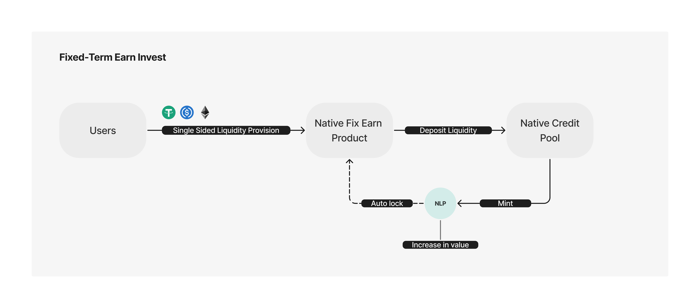
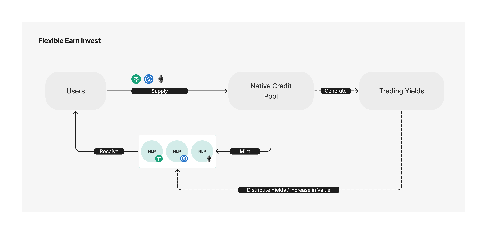
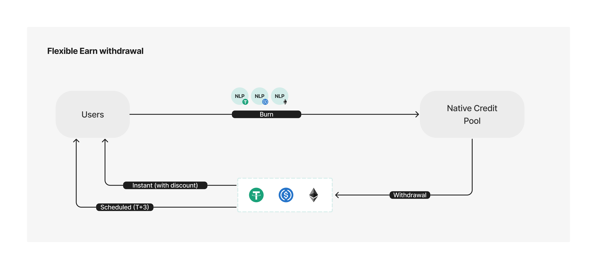

# Native Earn

Native enables liquidity providers to earn steady yields through single-sided liquidity provisioning. Within Native's system, there are two primary avenues for earning rewards: Flexible Earn and the Fixed-Term Earn product, all powered by Native credit pool. Native offers LPs a permissionless way to tap into best-in-class yield opportunities in single-sided liquidity provision on-chain, without the need to actively manage positions.

### Fixed-Term Earn Product

The Fixed-Term Earn product distributes a fixed annual percentage yield (Fixed APY) over a specified period (from \[Start Time] to \[End Time]). LP’s liquidity will be contributed to the Native Credit Pool and receive a predetermined APY for the term, regardless of the actual fluctuating yield in the pool. This provides an optimal experience for users seeking yield certainty.

#### How the Fixed-Term Earn Product Works

During the open deposit period, users can supply liquidity in major base tokens, for example, single-asset USDT or USDC, into the Native Fixed-Term Earn Product. User supplied funds flow into the Native Credit Pool, where the liquidity engages in trading activities.

From the Start Time to the End Time, liquidity providers earn the fixed APY, independent of the actual flexible yield rate generated in the Credit Pool. Upon successful deposit, users continue to receive the same fixed rate until the product’s maturity.

<figure><figcaption></figcaption></figure>

When the Fixed-Term Earn product matures (reaching the End Time), users can withdraw their principal plus the fixed rewards accrued over the entire deposit period. (For example, an LP who deposits 1,000 USDT at the beginning of a 1-year term with a 10% APY will receive 100 USDT in rewards)

Additionally, Native features an auto-rollover mechanism that allows matured but unwithdrawn funds to remain in the Credit Pool, continuing to generate yield and remaining ready for user withdrawal at any time.

<figure><figcaption></figcaption></figure>

### Flexible Earn Product

By supplying single-asset liquidity directly to the Native Credit Pool, LPs can also earn ongoing yields at a variable rate. This liquidity and the corresponding rewards can be withdrawn with a high degree of flexibility.

When a user supplies an asset (e.g., USDT, USDC) into the Native Credit Pool, corresponding NLP tokens (e.g., nUSDT, nUSDC) are minted and credited to them. NLP tokens represent share tokens of the Native Credit Pool. Their value increases continuously, and rewards are distributed to users through periodic rebalancing.

For example, assume initially that 1 nUSDT = 1 USDT, and a user mints 100 nUSDT with 100 USDT. After some time, as rewards accumulate, 1 nUSDT becomes redeemable for 1.1 USDT. The user’s 100 nUSDT would then be worth 110 USDT, representing a reward accumulation of 10 USDT.

<figure><figcaption></figcaption></figure>

Users realize their yields by burning NLP tokens to redeem their capital. Two withdrawal options are available: instant and scheduled.

* Users can withdraw their funds and rewards immediately at a 1% discount.
* Alternatively, they can schedule a withdrawal, which is processed within T+3 without any discount applied.

<figure><figcaption></figcaption></figure>
