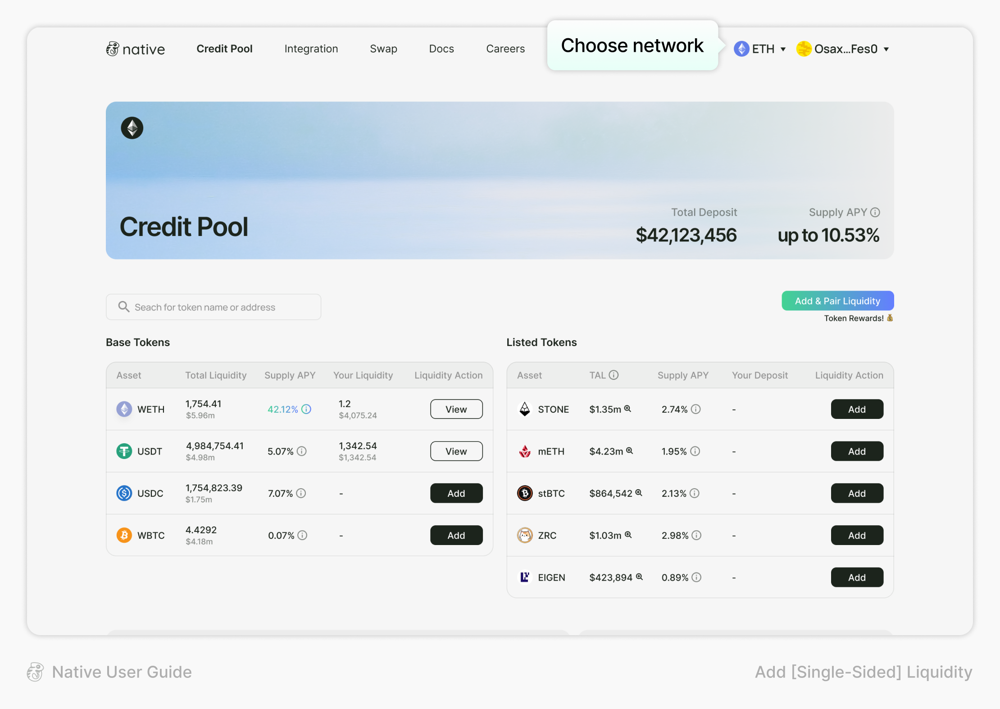
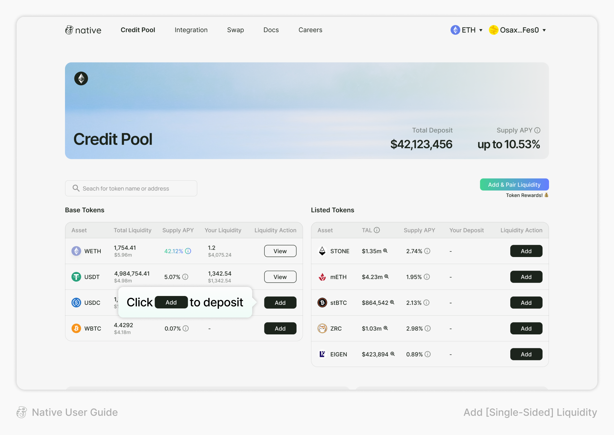
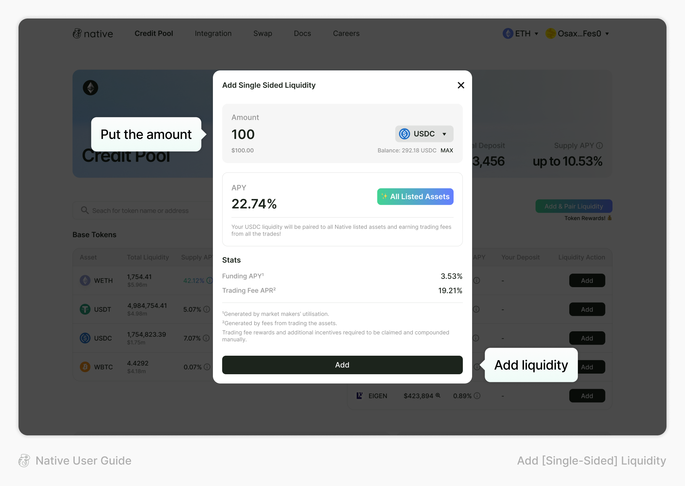
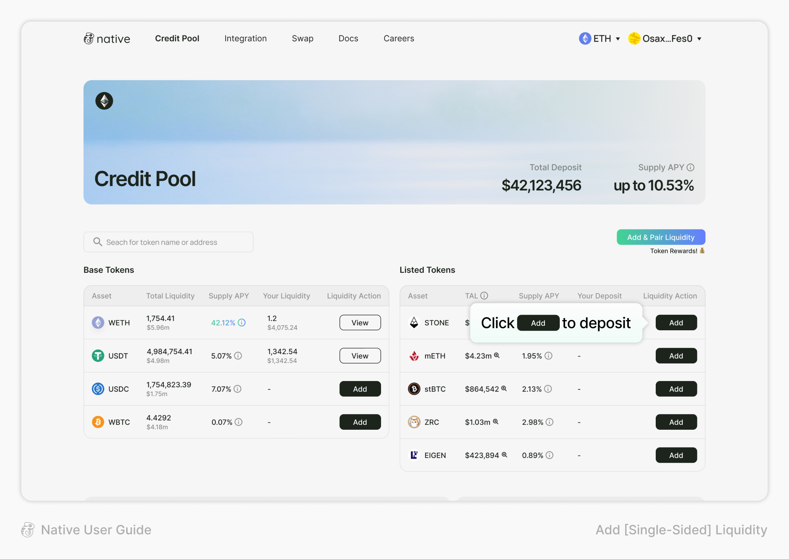
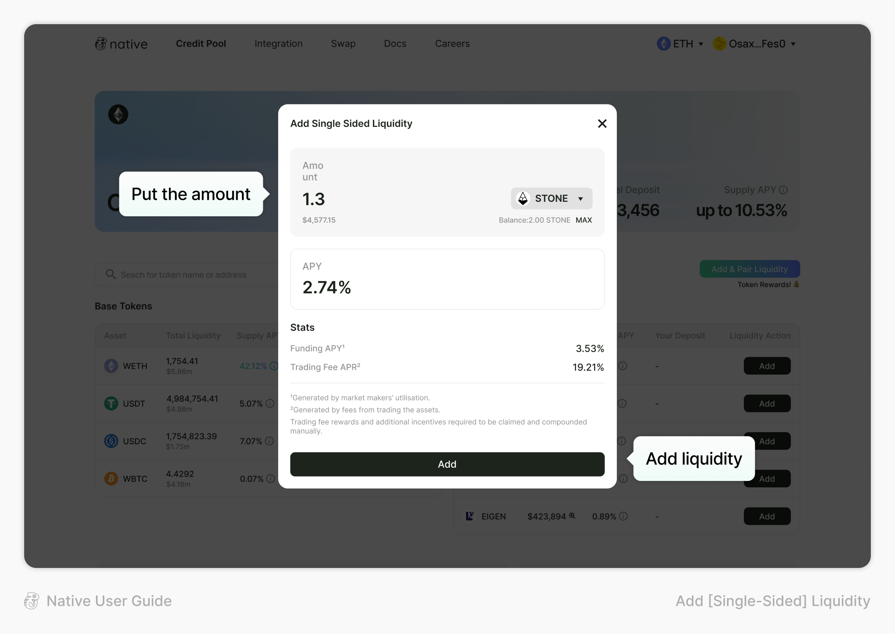

# Add Liquidity

#### **To Add Single-Sided Liquidity on Native:**

There are two token lists on Credit Pool, Base Tokens and Listed Tokens.

1. After connecting your wallet, choose the network you want to use

<figure><figcaption></figcaption></figure>

**\[Base Tokens]**

2. Select the token you want to deposit and click the “Add” button

<figure><figcaption></figcaption></figure>

3. Type the amount that you want to deposit and click the “Add” button

<figure><figcaption></figcaption></figure>

[Smart Pairing](/broken/pages/1wbWwNCfKsnSSxuXjl2t)? Your base token can be paired to all the listed tokens on Native. Enjoy high APY for base token deposit on Native!

**\[Listed Tokens]**

2. Select the token you want to deposit and click the “Add” button

<figure><figcaption></figcaption></figure>

3. Type the amount that you want to deposit and click the “Add” button

<figure><figcaption></figcaption></figure>
