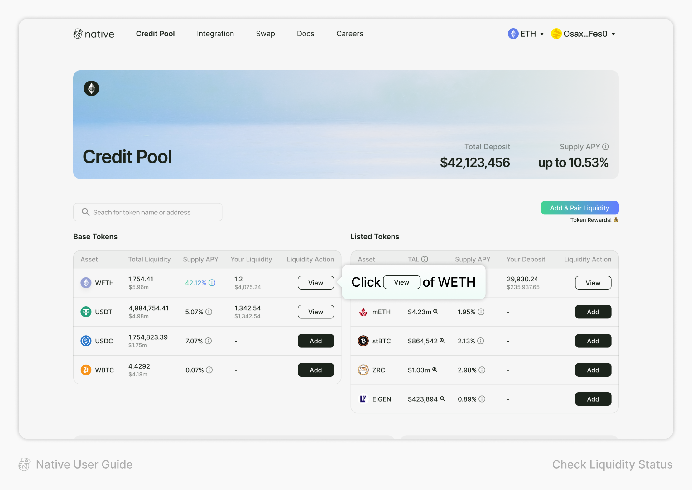
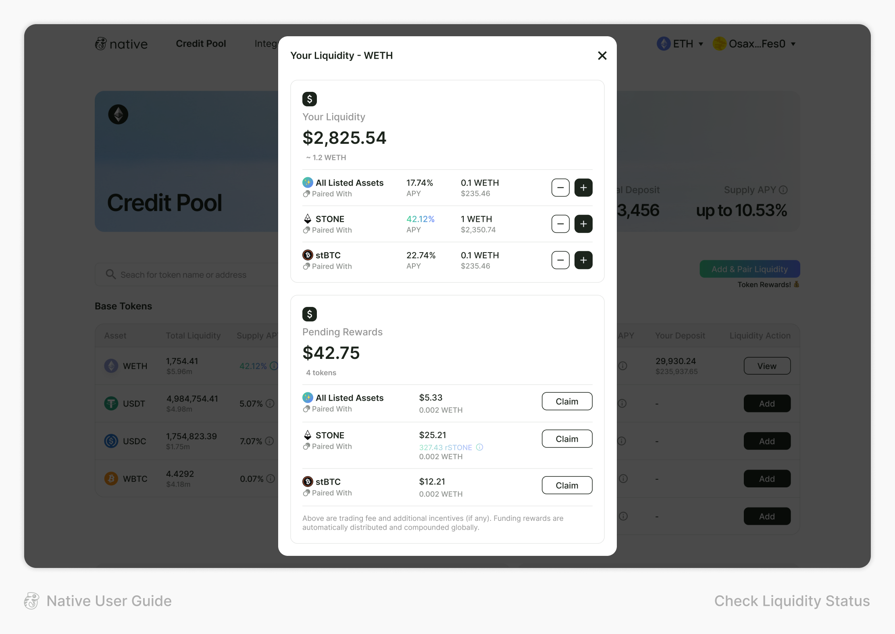
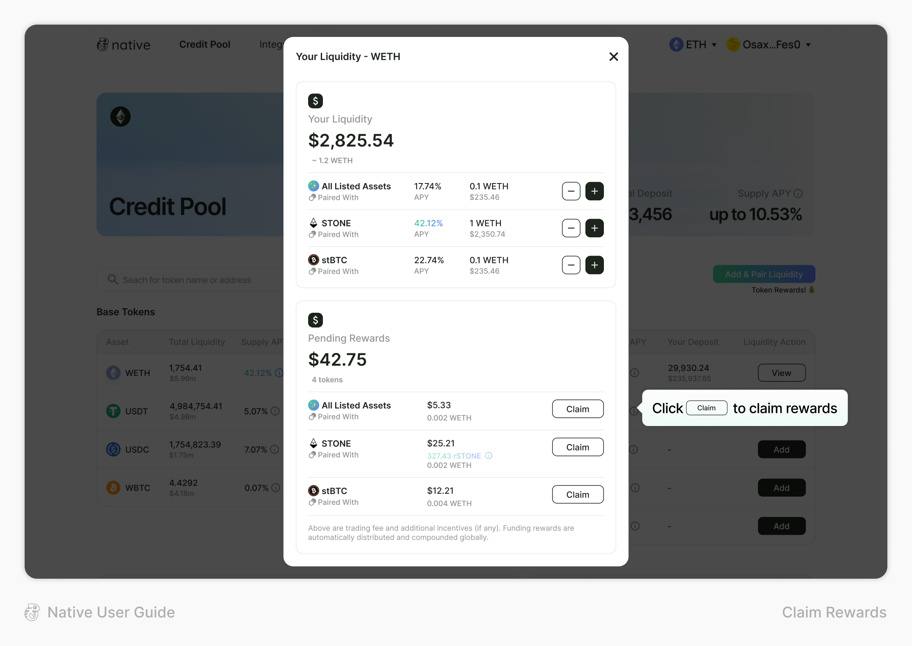
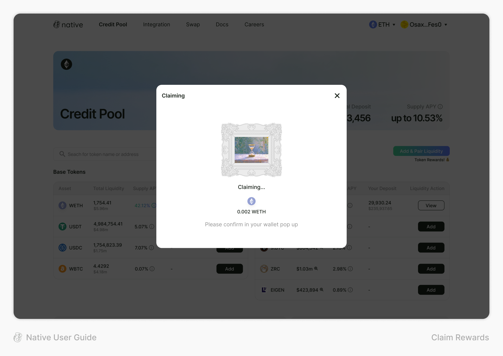

# Claim Rewards

**To Claim Rewards on Native:**

You can check the current liquidity status through each token’s view page and claim rewards

1. After connecting your wallet, choose the network you want to use

<figure><figcaption></figcaption></figure>

2. Click the “View” button of your asset to check your liquidity

<figure><figcaption></figcaption></figure>

3. Check your liquidity and its pairing status

<figure><figcaption></figcaption></figure>

4. Click the “Claim” button to claim your rewards

<figure><figcaption></figcaption></figure>

5. Claim rewards from each of your paired assets

<figure><figcaption></figcaption></figure>
