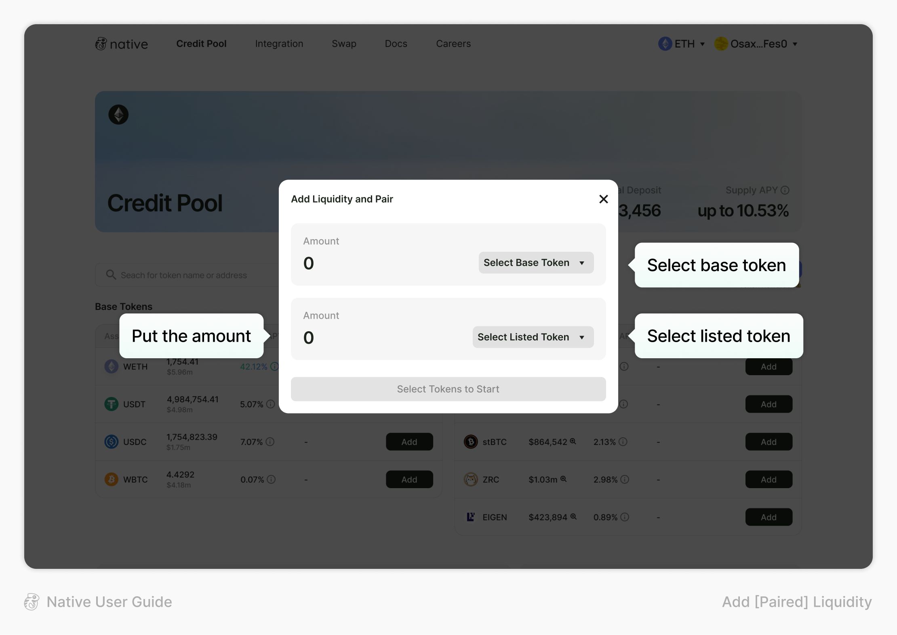
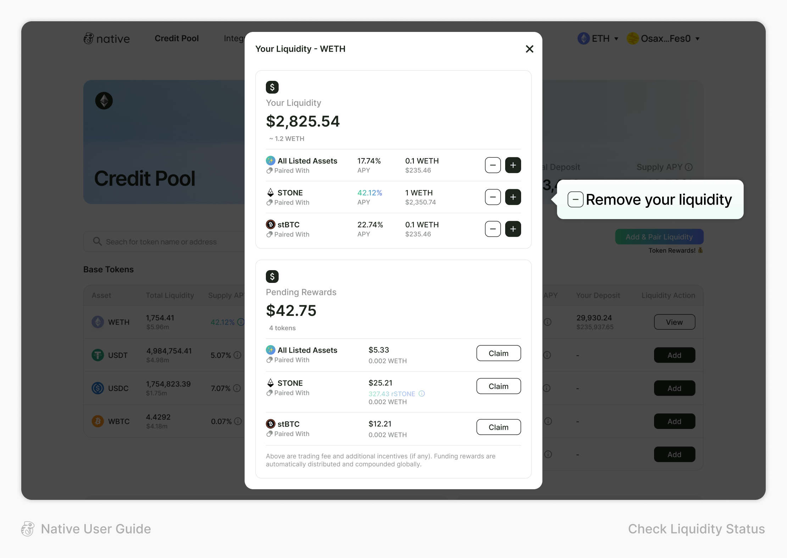

# Pair Liquidity

**To Add and Pair Liquidity on Native:**

1. After connecting your wallet, choose the network you want to use

<figure><figcaption></figcaption></figure>

2. Click the “Add & Pair Liquidity” button

<figure><figcaption></figcaption></figure>

3. Select the base token and listed token, type the amount that you want to deposit

<figure><figcaption></figcaption></figure>

4. Check the APY including pairing incentive APR and click the “Add and Pair” button

<figure><figcaption></figcaption></figure>

You get to enjoy the “pairing incentive APR” given by token issuers as a reward for dedicating your base token to pairing

<figure><figcaption></figcaption></figure>

#### **To Check your Liquidity Status on Native:**

You can check the current liquidity status through each token’s view page

1. Click the “View” icon of WETH

<figure><figcaption></figcaption></figure>

2. You can view the current pairing status of your WETH and its APY

<figure><figcaption></figcaption></figure>

3. If you want to remove your liquidity, click the “-” icon on the status page to withdraw

<figure><figcaption></figcaption></figure>
