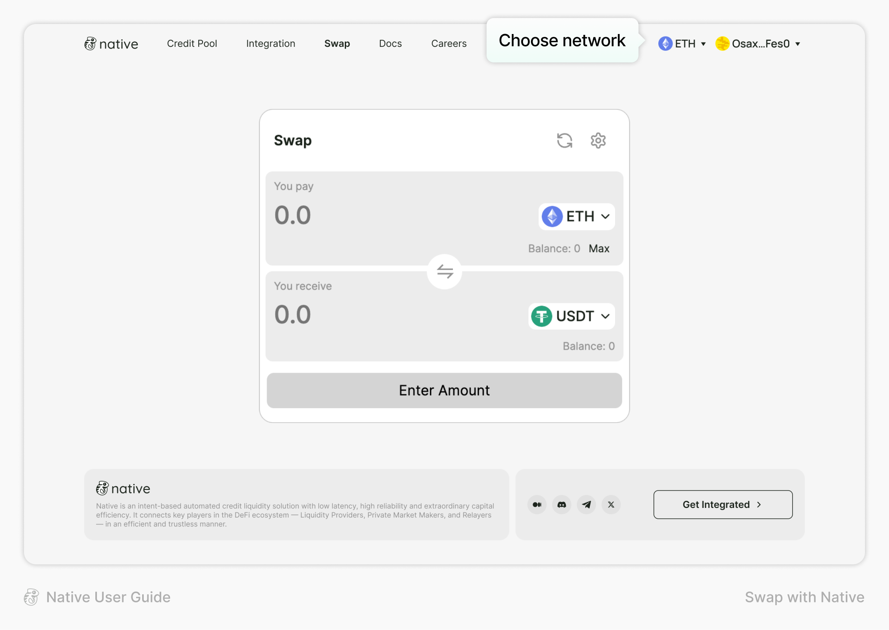
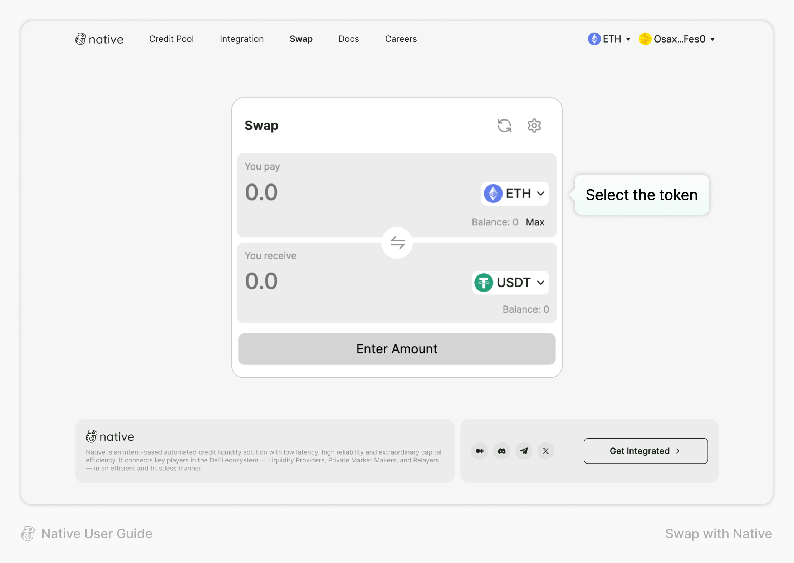
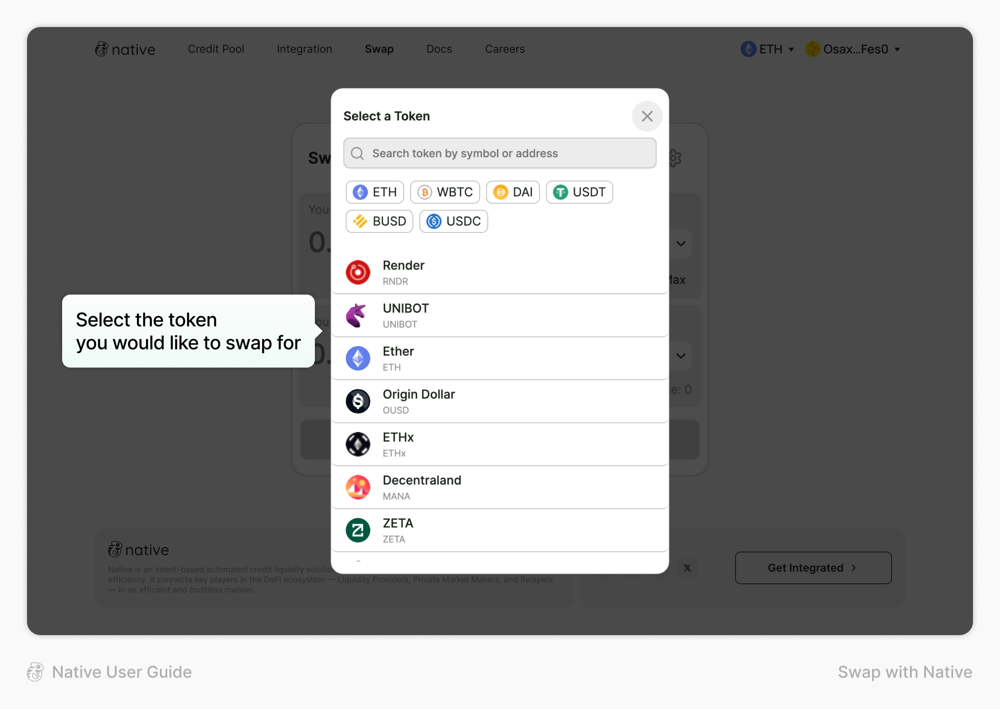

# Swap with Native

**To Swap on Native:**

1. Go to Swap page and choose Network

<figure><figcaption></figcaption></figure>

2. Select the token from the token list

<figure><figcaption></figcaption></figure>

<figure><figcaption></figcaption></figure>

3. Type the amount that you want to swap and click “Swap” button to execute a swap

<figure><figcaption></figcaption></figure>

<figure><figcaption></figcaption></figure>

4. Review the swap, Click “Confirm Swap” button and sign transaction using your own wallet

<figure><figcaption></figcaption></figure>

5. Transaction completed

<figure><figcaption></figcaption></figure>
